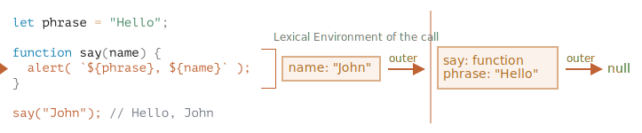
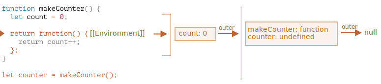

## JS Function Closures
JavaScript is a very function-oriented language. you can pass a function as an argument or return it as a result.

To imitate OOP languages[^1] objects(behavior+state), JS introduced inner functions(nested functions) with reference to its `lexical environment`.   

**Functions in JavaScript form closures**   
A closure is the combination of a function and the lexical environment within which that function was declared. This environment consists of any variables that were in-scope at the time the closure was created.

### what is scope?
Scope refers to the area where an item (such as a function or variable) is visible and accessible to other code.    
For example, Variables declared with *var* are either function-scoped or global-scoped.     
In JavaScript, there are 3 ways to declare a variable: `let`, `const` (the modern ones), and `var` (the remnant of the past).    
Blocks(curly braces{}, e.g. if statement) don't create a scope for `var`, In opposite to `let` and `const`.    
And, Inner scopes have access to outer scopes, For example following JS snippet works correctly:    
```Javascript
let x = 5; // global scoped variable
function init(){
    let y = 6; // local variable with function-scope
    return function() {
        return x + y;// this function has access to its outer scopes
    }
}
const initFunction = init();
console.log(initFunction());
```
### what is lexical?
Lexical refers to the definition of things.    
Another name for a dictionary is a lexicon. In other words, a lexicon is a dictionary where words are listed and defined.   

### Lexical Scope
Lexical scope is the definition area of an expression.    
In other words, an item's lexical scope is the place in which the item got created.     
In simple terms, lexical scope is the scope of a variable or function    
determined at compile time by its physical location in the sourcecode.     
Unlike dynamic scope, which depends on how functions are called at runtime.   

Variables and functions have different levels of scope:    
- Global Scope
    - Variables defined outside any function or block, accessible anywhere in the program.
- Local Scope 
    - Variables defined inside a function or block, accessible only within that specific function or block.
- Nested Scope 
    - Inner functions have access to variables in their parent functions.
- Block Scope
    - Variables defined with let and const are limited to the block they are declared in, like loops or conditionals.

### Practical example
Much of the code written in front-end JavaScript is event-based.    
You define some behavior, and then attach it to an event that is triggered by the user (such as a click or a keypress).     
The code is attached as a callback (a single function that is executed in response to the event).
```Javascript
function makeSizer(size) {
  return () => {
    document.body.style.fontSize = `${size}px`;
  };
}

document.getElementById("size-12").onclick = makeSizer(12);
document.getElementById("size-14").onclick = makeSizer(14);
document.getElementById("size-16").onclick = makeSizer(16);
```

### Lexical Environment, in-depth examination from javascript.info 
In JavaScript, each scope[^2] has an internal (hidden) associated object known as the `Lexical Environment`.    
The Lexical Environment object consists of two parts:
- Environment Record
    - stores all local variables as its properties (and some other information like the value of this).
- A reference to outer lexical environment  

When a Lexical Environment is created, a Function Declaration immediately becomes a ready-to-use function (unlike let, that is unusable till the declaration).    
Naturally, this behavior only applies to Function Declarations, not Function Expressions where we assign a function to a variable, such as let say = function(name)....

   
When a function runs, at the beginning of the call, a new Lexical Environment is created automatically to store local variables and parameters of the call.    
All functions remember the Lexical Environment in which they were made.    
Technically, there’s no magic here: all functions have the hidden property named [[Environment]], that keeps the reference to the Lexical Environment where the function was created:    
   

A closure is a function that remembers its outer variables and can access them.    
In JavaScript, all functions are naturally closures(except for constructor function)    
 

## References
- [javascript.info closure](https://javascript.info/closure)
- [MDN closure](https://developer.mozilla.org/en-US/docs/Web/JavaScript/Guide/Closures)
- [freecodecamp lexical scope](https://www.freecodecamp.org/news/javascript-lexical-scope-tutorial/)

[^1]: Object Oriented Programming refers to modeling everything as an object, each object has its own state(its instance variables) and behavior(its methods), OOP is all about modularity,  prominent OOP languages are Smalltalk, C/C++, Java 
[^2]: every running function, code block {...}, and the script as a whole